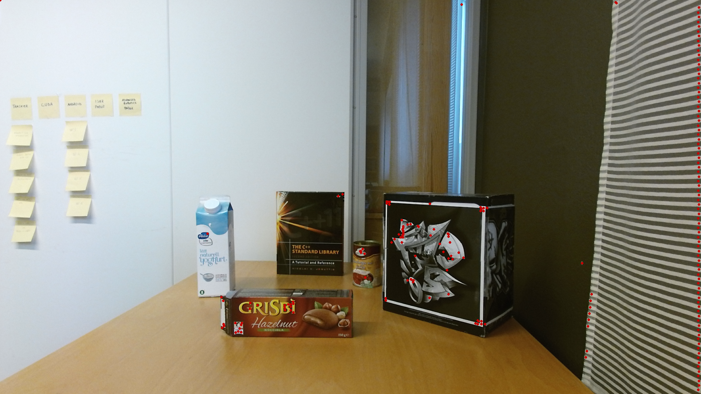
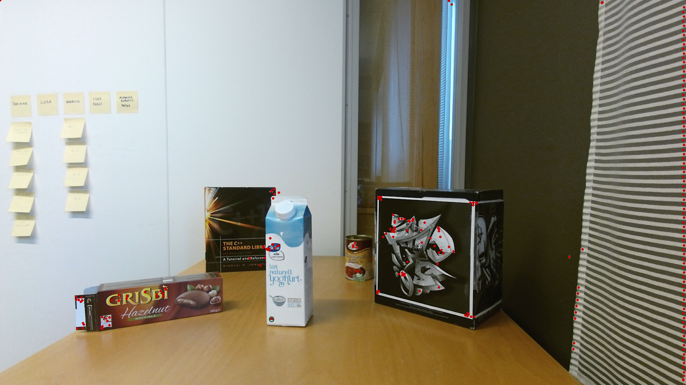

# CUDA Accelerated Keypoints Detection for Blob-like Structure in SURF

## Introduction

This project implements the keypoints detection and localization part in Speed Up Robust Features (SURF) for blob-like structure in the image.

## Performance 

Tested using 1920x1080 image on GTX 1060 GPU, with 3 Octaves and each octave contains 4 levels of response map.

| Process                                                 | Computation Time |
| ------------------------------------------------------- | ---------------- |
| Integral Image                                          | 0.8ms            |
| Fill all octaves                                        | 6ms              |
| Thresholding, Non-max suppression and extract keypoints | 0.7ms            |

# Run  Exaample

```bash
mkdir build
cd build
cmake ..
make 
cd ..
./bin/run_single_image 
```


## Result





